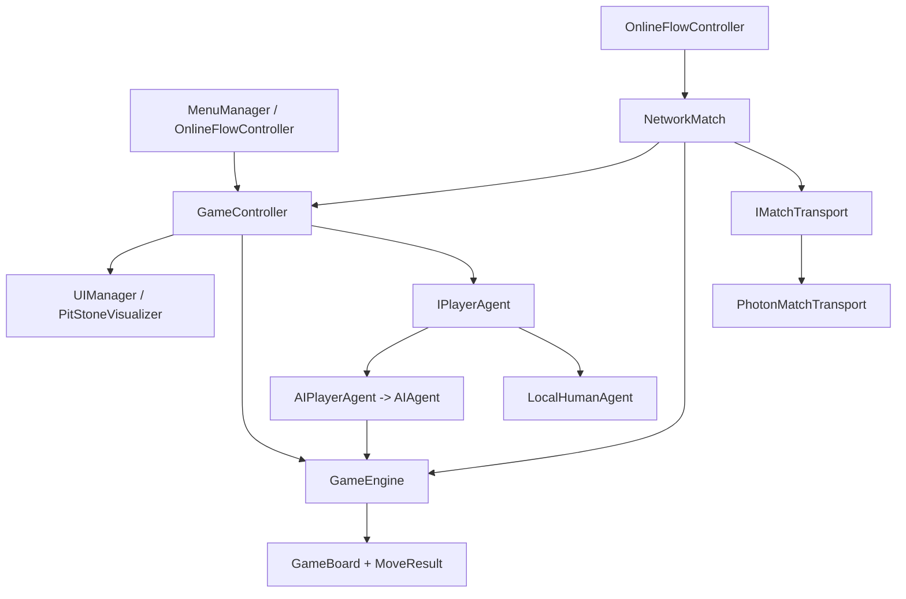

# Nsolo

Nsolo is a Unity implementation of a four-row mancala-family board game for Android. It supports
three ways to play:

- **Single-player:** play against an AI at Easy, Medium, or Hard difficulty.
- **Hot-seat:** two people play on the same device.
- **Online:** two people play through a six-character Photon room code.

The AI search is the main assessed technical component. The board rules, UI, local multiplayer, and
online multiplayer provide the game around it and are deliberately layered so that adding those
features did not require changing the rules engine or the search.

## Installation

### Prerequisites

- **[Unity Hub](https://unity.com/download)**, then use it to install editor version
  **2022.3.62f3** exactly (Unity Hub > Installs > Install Editor > Archive, or search that version
  number). Using a different 2022.3.x patch usually opens fine, but matching the version avoids
  Unity's "upgrade this project" prompt and any editor-version-specific serialization diffs.
- During that install, tick the **Android Build Support** module (and its two sub-modules,
  **OpenJDK** and **Android SDK & NDK Tools**) if you want to build an installable APK rather than
  only running the game inside the editor. You can add this module later from Unity Hub > Installs
  if you skip it now.
- **Git**, to clone the repository.
- No separate Photon account or App ID is needed to try online play — the project already ships
  with a configured Photon App ID for the free tier, good enough for testing. Swap in your own from
  the [Photon dashboard](https://dashboard.photonengine.com/) in
  `Assets/Photon/PhotonUnityNetworking/Resources/PhotonServerSettings.asset` if you plan to publish
  your own build.

### Get the project running

1. Clone the repository:
   ```bash
   git clone https://github.com/Nanetu/Nsolo.git
   ```
2. Open **Unity Hub > Add > Add project from disk**, and select the cloned `Nsolo` folder (the one
   containing `Assets/`, `Packages/`, and `ProjectSettings/`).
3. Click the project to open it. Unity will import assets and compile scripts on first open — this
   can take several minutes and the editor will look unresponsive during the initial import; let it
   finish.
4. In the **Project** window, open `Assets/Prefabs/Scenes/SampleScene.unity` (this is the game's
   only scene; it should already be open by default).
5. Press **Play** in the Editor toolbar. Use the main menu to choose Single-player, Hot-seat, or
   Online.

### Building an installable APK (Android)

1. **File > Build Settings**, make sure **Android** is the selected platform (switch platform if
   it isn't — first switch can take a while).
2. Make sure **Development Build** is unticked for anything you intend to share, so the build
   doesn't carry a debug watermark — or use the editor menu **Nsolo > Build > Clear Development
   Build Flags**, which also guards the build so a ticked box fails loudly instead of shipping a
   watermarked APK by accident.
3. Click **Build** (or **Build And Run** with an Android device connected over USB with Developer
   Options/USB debugging enabled), and choose an output location for the `.apk`.
4. Install the resulting APK on an Android device (minimum SDK 22 / Android 5.1) the normal way —
   copy it over and open it, or `adb install path/to/app.apk`.

### Online play

Two devices can play each other once each has a build (or Editor instance) running the same Photon
App ID, network protocol, and game version — which is the default out of the box, so any two builds
from this repository can already room-code into a match. One player creates a room and shares the
six-character code; the other joins with it.

The Unity project settings and package manifest are committed as part of the repository; generated
folders such as `Library/`, `Temp/`, `obj/`, and `Logs/` are editor output, not application source,
and are excluded via `.gitignore` — Unity regenerates them on first open.

### Troubleshooting

- **"This project was created with a newer/older version of Unity"** — install exactly 2022.3.62f3
  via Unity Hub instead of letting Hub pick a nearby version.
- **Pink/magenta materials** — usually means the Universal Render Pipeline package didn't finish
  importing; reopen the project and let Unity finish compiling before pressing Play.
- **Two builds can't find each other online** — confirm both were built from the same commit (same
  Photon App ID and `AppVersion` in `PhotonServerSettings.asset`), and that both devices have a
  working internet connection.

## Repository Structure

```text
Assets/
  Scripts/NsoloGame/
    Core/       Board representation, moves, sowing paths, and game rules
    AI/         Minimax search, evaluation, and transposition table
    Players/    Common player-agent interface plus human and AI adapters
    Net/        Online protocol, Photon transport, and authoritative matches
    Unity/      GameController, menus, HUD, animation, audio, profile, and UI wiring
    Editor/     Unity editor validation tools, including UI wiring checks
  Audio/        Music and sound assets
  Materials/    Board, UI, and imported Figma materials
  Models/       3D board and scene models
  Prefabs/      Reusable Unity objects
  Photon/       Photon-related Unity assets/settings
  TextMesh Pro/ Text rendering assets
  textures/     Image and texture assets
  UI Soundpack/ UI sound assets
Packages/
  manifest.json Unity package and Figma importer dependencies
ProjectSettings/ Unity version, build, Android, input, and project configuration
FigmaSource/    Original Nsolo UI design source
docs/           Wiring guides, multiplayer notes, remaining work, and report material
Tools/          Project support tools
```

The generated `.csproj` files and `Nsolo.sln` are useful for code navigation and IDE compilation,
but Unity is the source of truth for scenes, serialized components, prefabs, and asset references.

## Runtime Architecture

The important dependency direction is:



### Core game flow

1. `MenuManager` records the selected mode and difficulty.
2. `GameController` creates the correct local agents and initializes a `GameBoard`.
3. The current `IPlayerAgent` is asked asynchronously for a `Move`.
4. A human agent completes its pending task when a legal pit is tapped. The AI agent runs the
   existing CPU-bound search on a background task.
5. `GameController` sends the move to `GameEngine.ApplyMoveWithResult`.
6. `GameEngine` clones the board, applies sowing, relay, and capture rules, and returns a
   `MoveResult` containing the new board and the landing/sowing data needed for animation.
7. `UIManager` animates the result, refreshes the stones, scores, status, timer, and last-move text.
8. The engine checks whether the next player has a legal move. If not, `GameController` raises its
   game-over event and the UI shows the result.

The rules layer does not know about Unity UI, AI, Photon, or persistence. That separation is the
central architectural argument for the project.

## Game Rules and Board Model

The main rules implementation is [`GameEngine.cs`](Assets/Scripts/NsoloGame/Core/GameEngine.cs).
The state model is [`GameBoard.cs`](Assets/Scripts/NsoloGame/Core/GameBoard.cs), and the movement
path is [`SowingPath.cs`](Assets/Scripts/NsoloGame/Core/SowingPath.cs).

- The board has **4 rows x 8 columns = 32 pits**, stored as a flat row-major `int[32]`.
- Player 1 owns rows 0 and 1; player 2 owns rows 2 and 3.
- Every pit starts with two stones, for 64 stones total.
- A legal move selects one of the player's pits containing at least two stones.
- Stones are sown counterclockwise around that player's two rows only. Each player therefore has a
  16-pit sowing loop and never sows directly onto the opponent's side.
- If the final stone lands in a pit that was empty before that stone, the turn ends.
- An occupied landing on the player's inner row can capture both occupied opponent pits in the same
  column. Captured stones are resown from after the original source pit.
- If the capture condition is not met, the inner-row landing relays.
- An occupied outer-row landing always relays.
- A player with no legal move loses; the other player wins.

`GameEngine` is stateless from the caller's point of view: it clones the input board and returns a
new state. This makes the same implementation safe for normal play, AI search, and host-side online
validation.